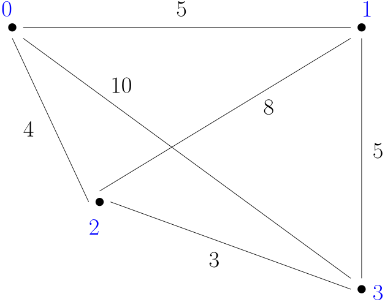

=================
Python TSP Solver
=================

``python-tsp`` is a library written in pure Python for solving typical Traveling
Salesperson Problems (TSP). It can work with symmetric and asymmetric versions.

Installation
============
.. code:: bash

  pip install python-tsp
  poetry add python-tsp  # if using Poetry in the project

Quickstart
==========

Regular TSP problem
-------------------

Suppose we wish to find a Hamiltonian path with least cost for the following
problem:

We can find an optimal path using a Dynamic Programming method with:

.. code:: python

   import numpy as np
   from python_tsp.exact import solve_tsp_dynamic_programming

   distance_matrix = np.array([
       [0,  5, 4, 10],
       [5,  0, 8,  5],
       [4,  8, 0,  3],
       [10, 5, 3,  0]
   ])
   permutation, distance = solve_tsp_dynamic_programming(distance_matrix)

The solution will be ``[0, 1, 3, 2]``, with total distance 17.

There are also heuristic-based approaches to solve the same problem. For instance, to use a local search method:

.. code:: python

   from python_tsp.heuristics import solve_tsp_local_search

   permutation, distance = solve_tsp_local_search(distance_matrix)

In this case there is generally no guarantee of optimality, but in this small instance the answer is normally a permutation with total distance 17 as well (notice in this case there are many permutations with the same optimal distance).

You can check `here to see the list of available solvers <docs/solvers.rst>`_.

Keep in mind that, by definition, the route always starts and finishes at node 0 (a closed path). So, in the previous example, after node 2 we go back to 0.

Open TSP problem
----------------

If your problem is of the "open" type, i.e., it is not required to go back to the origin, you can "trick" the solvers by setting all elements of the first column of the distance matrix to zero:

.. code:: python

   distance_matrix[:, 0] = 0
   permutation, distance = solve_tsp_dynamic_programming(distance_matrix)

and we obtain ``[0, 2, 3, 1]``, with distance 12. Keep in mind that we still start and end at 0, but since the distance from everyone to 0 is null, in practice it is the same as stopping at node 1.

Notice that in this case the distance matrix is actually asymmetric, but the methods here are applicable as well.

Computing a distance matrix
---------------------------

The previous examples assumed you already had a distance matrix. If that is not the case, the ``distances`` module has prepared some functions to compute an Euclidean distance matrix, a Great Circle Distance, street distances (via OSRM) and support for TSPLIB-type files. Check the `docs folder <docs/distances.rst>`_ for some examples.

A more intricate example
------------------------

Let us attempt to solve the ``a280.tsp`` TSPLIB file. It has 280 nodes, so an exact approach may take too long. Hence, let us start with a Local Search (LS) solver:

.. code:: python

    from python_tsp.distances import tsplib_distance_matrix
    from python_tsp.heuristics import solve_tsp_local_search, solve_tsp_simulated_annealing

    # Get corresponding distance matrix
    tsplib_file = "tests/tsplib_data/a280.tsp"
    distance_matrix = tsplib_distance_matrix(tsplib_file)

    # Solve with Local Search using default parameters
    permutation, distance = solve_tsp_local_search(distance_matrix)
    # distance: 3064

When calling ``solve_tsp_local_search`` like this, we are starting with a random permutation, using the 2-opt scheme as neighborhood, and running it until a local optimum is obtained. Check `the solvers documentation <docs/solvers.rst>`_ for more information.

In my specific run, I obtained a permutation with total distance 3064. The actual best solution for this instance is 2579, so our solution has a 18.8% gap. Remember this solver is a heuristic, and thus it has no business in finding the actual optimum. Moreover, you can get different results trying distinct perturbation schemes and starting points.

Since the local search solver only obtains local minima, maybe we can get more lucky with a metaheuristic such as the Simulated Annealing (SA):

.. code:: python

    permutation2, distance2 = solve_tsp_simulated_annealing(distance_matrix)
    # distance: 2830

In my execution, I got a 2830 as distance, representing a 9.7% gap, a great improvement over the local search. The SA input parameters are basically the same as the LS, but you can check `the solvers documentation <docs/solvers.rst>`_ for more details as well.

If you are familiarized with metaheuristics, you would know that the SA does not guarantee a local minimum, despite its solution being better than the LS in this case. Thus, maybe we can squeeze some improvement by running a local search starting with its returned solution:

.. code:: python

    permutation3, distance3 = solve_tsp_local_search(distance_matrix, x0=permutation2)
    # distance: 2825

So, that was o.k., nothing groundbreaking, but a nice combo to try in some situations. Nevertheless, if we change the perturbation scheme to, say, PS3:

.. code:: python

    permutation4, distance4 = solve_tsp_local_search(
        distance_matrix, x0=permutation2, perturbation_scheme="ps3"
    )
    # distance: 2746

and there we go, a distance of 2746 or a 6.5% gap of the optimum. Notice we set the ``x_0`` to the permutation returned by the SA in the last run.

Check again `the solvers documentation <docs/solvers.rst>`_ to get an idea of these perturbation schemes.

In this case, PS3 and PS6 have larger neighborhood sizes, so we may get a better chance of improvement by switching to them in the LS step. Test other schemes and see if you can get different results.

Finally, if you don't feel like fine-tunning the solvers for each problem, a rule of thumb that worked relatively well for me is to run the SA with a 2-opt and follow it by a LS with PS3 or PS6, like

.. code:: python

    permutation, distance = solve_tsp_simulated_annealing(distance_matrix)
    permutation2, distance2 = solve_tsp_local_search(
        distance_matrix, x0=permutation, perturbation_scheme="ps3"
    )

Methods available
=================

See `here <docs/solvers.rst>`_ for a list of available solvers and how to use them.

For developers
==============
The project uses `Python Poetry <https://python-poetry.org/>`_ to manage dependencies. Check the website for installation instructions.

After that, clone the repo and install dependencies with ``poetry install``.

Here are the detailed steps that should be followed before making a pull request:

.. code:: bash

  # Black and flake8 to be conformant with PEP8
  poetry run black .
  poetry run flake8 . --count --select=E9,F63,F7,F82 --show-source --statistics --ignore=E203,W503
  poetry run flake8 . --count --exit-zero --max-complexity=10 --max-line-length=79 --statistics

  # Mypy for proper type hints
  poetry run mypy --ignore-missing-imports .

You can also run all of these steps at once with the check-up bash script:

.. code:: bash

   ./.scripts/checkup_scripts.sh
   bash ./.scripts/checkup_scripts.sh  # if the previous one fails

Finally (and of course), make sure all tests pass and you get at least 95% of coverage:

.. code:: bash

  poetry run pytest --cov=. --cov-report=term-missing --cov-fail-under=95 tests/

Python version support
======================

To help keeping this library relatively up to date and maintainable but not to a point of becoming bleeding edge, it follows at least the `supported version of Debian Stable <https://wiki.debian.org/Python>`_. New features won't be backported to older versions, but this can be accomplished for bug fixes. Just open an issue in case you find a problem.

Release Notes and Changelog
===========================

Releases 0.5.X
--------------

Release 0.5.0
~~~~~~~~~~~~~
- Upgrade Numpy dependency to 2.0 as per `#58 <https://github.com/fillipe-gsm/python-tsp/issues/58>`_. Thanks, @CoolCat467, for the contribution.

Python support: Python >= 3.9

Releases 0.4.X
--------------

Release 0.4.2
~~~~~~~~~~~~~
- Fix bug `#53 <https://github.com/fillipe-gsm/python-tsp/issues/53>`_ that Lin and Kernighan and Record to Record heuristics fail on problems with < 4 nodes. Since this is a must for these heuristics to work, they now default to a brute force in such cases.

Python support: Python >= 3.9

Release 0.4.1
~~~~~~~~~~~~~
- Add Lin and Kernighan and Record to Record methods to the list of heuristic solvers. Thanks @luanleonardo for this contribution.

  Keep in mind that these solvers are more recent and less tested, so if you experience a problem feel free to open an issue.

Python support: Python >= 3.9

Release 0.4.0
~~~~~~~~~~~~~

- Add Branch and Bound to the list of exact solvers. Thanks @luanleonardo for this contribution.

Python support: Python >= 3.8.1

Releases 0.3.X
--------------

Release 0.3.1
~~~~~~~~~~~~~
- Replace heuristic log messages with regular prints. The logs could be compromised with outer level configurations and start to pollute the stdout. Prints are easier to manipulate.
- Add a ``verbose`` parameter to heuristics to print execution messages in the stdout.

  Thanks for @FrickTobias for pointing this issue and providing a fix.

Python support: Python >= 3.7.1

Release 0.3.0
~~~~~~~~~~~~~

- Add support for street distance matrix calculation via an OSRM server.

Python support: Python >= 3.7.1

Releases 0.2.X
--------------

Release 0.2.1
~~~~~~~~~~~~~

- Improve TSLIB support by using the `TSPLIB95 library <https://pypi.org/project/tsplib95/>`_ .

Python support: Python >= 3.6

Release 0.2.0
~~~~~~~~~~~~~

- Add distance matrix support for TSPLIB files (symmetric and asymmetric instances);
- Add new neighborhood types for local search based methods: PS4, PS5, PS6 and 2-opt;
- Local Search and Simulated Annealing use 2-opt scheme as default;
- Both local search based methods now respect a maximum processing time if provided;
- The primitive `print`  to display iterations information is replaced by a proper log.

Python support: Python >= 3.6

Releases 0.1.X
--------------

Release 0.1.2
~~~~~~~~~~~~~

- Local search and Simulated Annealing random solution now begins at root node
  0 just like the exact methods.

Python support: Python >= 3.6

Release 0.1.1
~~~~~~~~~~~~~

- Improve Python versions support.

Python support: Python >= 3.6

Release 0.1.0
~~~~~~~~~~~~~

- Initial version. Support for the following solvers:

  - Exact (Brute force and Dynamic Programming);
  - Heuristics (Local Search and Simulated Annealing).

- The local search-based algorithms can be run with neighborhoods PS1, PS2 and PS3.

Python support: Python >= 3.8

Contributors
============

- @FrickTobias
- @luanleonardo
- @CoolCat467
